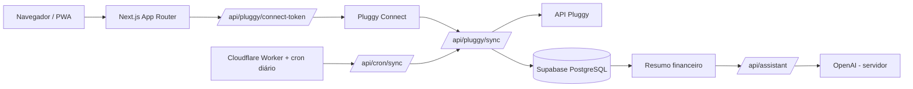

# StableAI


Assistente financeiro pessoal que transforma contas, gastos e planos em uma visão simples e acionável. A aplicação está disponível em [app.stableai.workers.dev](https://app.stableai.workers.dev/) e pode ser instalada como PWA no iPhone ou Android.


## Problema

Dados financeiros ficam espalhados entre bancos, cartões, boletos e planilhas. O StableAI reúne essas fontes, classifica os gastos e ajuda a planejar compras sem movimentar o dinheiro do usuário. Ele é um assistente/organizador: não faz PIX, não paga boletos e não executa ordens de investimento.

## Produto

- Conexão consentida com bancos por Pluggy, incluindo sincronização diária.
- Gastos separados por PIX, cartão, boleto, recorrência e categoria, com gráficos e histórico de seis meses.
- Boletos/DDA quando o conector fornece `paymentData`, além de lançamentos manuais.
- Registro de compras emprestadas no cartão para lembrar quem deve reembolsar.
- Cofrinhos, metas, lista de desejos e cálculo determinístico de prazo para uma compra.
- Instrutor financeiro por IA que recebe somente um resumo agregado.
- Modo convidado com dados fictícios para explorar o produto; conexões bancárias e personalização ficam bloqueadas com cadeado até o cadastro.

## Arquitetura



## Decisões técnicas

| Tema | Decisão e motivo |
| --- | --- |
| Aplicação | Next.js 16 + React 19 + TypeScript, com App Router e PWA responsiva. |
| Dados | Supabase PostgreSQL e Auth. A migração ativa RLS como defesa em profundidade; as rotas de servidor usam `service_role`, por isso cada consulta também filtra explicitamente pelo `user.id`. |
| Credenciais | Client Secret Pluggy, `service_role`, segredo de cron, chave de criptografia e chave OpenAI são somente de servidor; nenhum deles usa `NEXT_PUBLIC_`. |
| Privacidade da IA | O cliente envia apenas totais agregados, metas e margem mensal. A rota usa `store: false` e não envia CPF, credenciais ou linhas digitáveis. |
| Regras financeiras | Classificação, parsing monetário e prazo das metas são determinísticos em `lib/finance.ts`, com testes Vitest. |
| Integração bancária | Pluggy Connect coleta o consentimento; o servidor cria o token temporário, sincroniza transações e valida a propriedade do item antes de persistir. |
| Infraestrutura | OpenNext empacota o Next.js para Cloudflare Workers. O cron `0 9 * * *` dispara a reconciliação diária e a observabilidade do Worker fica habilitada. |

## Tecnologias

| Camada | Tecnologias |
| --- | --- |
| App e API | TypeScript, Next.js 16, React 19, Zod |
| Interface | CSS, Radix Themes, Phosphor Icons, Recharts |
| Dados e auth | Supabase Auth, PostgreSQL/PLpgSQL, RLS |
| Bancos | Pluggy Connect e API Pluggy |
| Deploy | Cloudflare Workers, OpenNext, PWA/service worker |
| Qualidade | Vitest, ESLint, TypeScript (`tsc --noEmit`) |

## Executar localmente

```bash
npm install
cp .env.example .env.local
npm run dev
```

Abra [http://localhost:3000](http://localhost:3000). Sem Supabase configurado, escolha **Entrar como convidado** para explorar dados fictícios e testar gastos, planejamento e investimentos sem credenciais reais. Alterações da demonstração ficam no `localStorage` do navegador.

## Contas reais

1. Crie um projeto no [Supabase](https://supabase.com/) e execute [`supabase/migrations/001_initial.sql`](supabase/migrations/001_initial.sql) no SQL Editor.
2. Ative E-mail, Telefone, Google e Facebook em Authentication e cadastre a URL de callback `${NEXT_PUBLIC_APP_URL}/auth/callback`.
3. Preencha `NEXT_PUBLIC_SUPABASE_URL` e `NEXT_PUBLIC_SUPABASE_ANON_KEY`.
4. Preencha no servidor `SUPABASE_SERVICE_ROLE_KEY`, `PLUGGY_CLIENT_ID`, `PLUGGY_CLIENT_SECRET`, `PLUGGY_WEBHOOK_SECRET`, `CRON_SECRET` e `BOLETO_ENCRYPTION_KEY`.
5. Opcionalmente configure `OPENAI_API_KEY`/`OPENAI_MODEL` para o instrutor, e `RESEND_API_KEY`/`NOTIFICATION_FROM_EMAIL` para lembretes por e-mail.

Use o Sandbox Pluggy durante o desenvolvimento. Nunca coloque `SUPABASE_SERVICE_ROLE_KEY`, `PLUGGY_CLIENT_SECRET`, `CRON_SECRET`, `BOLETO_ENCRYPTION_KEY` ou `OPENAI_API_KEY` em variáveis `NEXT_PUBLIC_`. Segredos enviados por chat ou copiados para outro local devem ser rotacionados antes de produção.

## Segurança e CSP

- Autenticação e autorização: as rotas exigem token Supabase, validam `user.id` e isolam os registros; RLS protege caminhos que acessam o banco diretamente.
- Linhas digitáveis são cifradas antes de persistir no estado financeiro; a chave fica somente no servidor.
- O metadata fetch bloqueia destinos privados, redirects indevidos, respostas grandes e tempos excessivos.
- A sincronização Pluggy confirma que `clientUserId` do item pertence ao usuário antes de gravar dados.

O middleware aplica estes controles de Content Security Policy:

| Diretiva | Regra |
| --- | --- |
| `script-src` | `'self'`, nonce por requisição e `strict-dynamic`; sem `unsafe-inline` em produção. |
| `connect-src` | Origem própria, Supabase e Pluggy. O navegador não chama OpenAI diretamente; por isso `api.openai.com` não é permitido. |
| `frame-src` | Somente `https://connect.pluggy.ai`. |
| `style-src` | `'self' 'unsafe-inline'` por compatibilidade com estilos dinâmicos da interface; isso não libera scripts inline. |
| Outros | `object-src 'none'`, `frame-ancestors 'none'`, `form-action 'self'`, `worker-src 'self' blob:` e upgrade para HTTPS. |

## Qualidade

```bash
npm run lint
npm run typecheck
npm run test
npm run build
```

O workflow [`ci.yml`](.github/workflows/ci.yml) executa typecheck, lint e Vitest em todo push e pull request.

## Limitações conhecidas

- O rate limiting em memória é local a cada instância do Worker; produção com alto tráfego deve usar um mecanismo distribuído da Cloudflare.
- A atualização depende das capacidades e da validade do consentimento de cada conector Pluggy; DDA não é universal.
- O produto é somente leitura/organização: não movimenta recursos, não paga boletos e não substitui orientação financeira profissional.
- O assistente não fornece recomendação personalizada de investimento; ele explica os dados fornecidos pelo usuário.

## Licença

MIT. Consulte [`LICENSE`](LICENSE).
